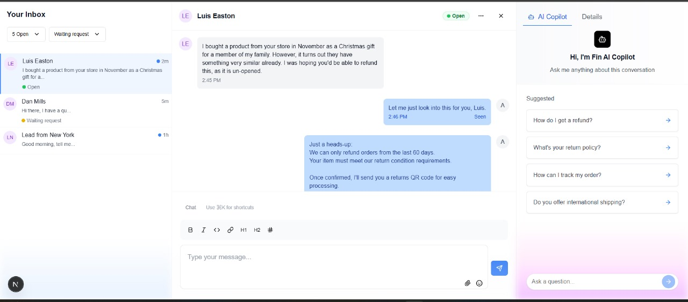
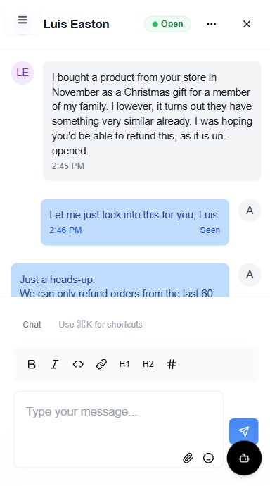

# BeyondChats Admin Panel Assignment

This repository contains the submission for the BeyondChats internship assignment. The task was to replicate the UI and functionality of Intercom’s AI-enhanced admin panel as demonstrated in the provided video.

**Reference video**: [Intercom Admin Panel Demo](https://drive.google.com/file/d/1WVvh4VmKJQ6jisIbzfutVmmeZj7IuD4c/view?usp=sharing)

---

## Live Demo

**Deployed Application**: [https://your-deployment-url.vercel.app](https://beyond-chats-aasignment.vercel.app/)

---

## Technologies Used

- **Frontend Framework**: React (with Vite)
- **Styling**: Tailwind CSS
- **Routing**: React Router
- **Animations**: Framer Motion
- **Icons**: Lucide / Heroicons
- **State Management**: React Hooks

---

## Features Implemented

- Sidebar with navigation, active states, and tooltips
- Chat user list with previews, timestamps, and unread badges
- AI assist panel with mocked prompt suggestions
- Light/Dark mode toggle
- Responsive layout for mobile, tablet, and desktop
- Chat view pane with user details and message interaction
- Smooth transitions and animations
- Clean, modular, and readable codebase

---

## Screenshots

### Desktop View



### Mobile View (Sidebar Collapsed)




---

## Getting Started

To run the project locally:

```bash
git clone https://github.com/your-name/beyondchats-admin-panel.git
cd beyondchats-admin-panel
npm install
npm run dev

